## x-transformers

[](https://badge.fury.io/py/x-transformers)

A concise but fully-featured transformer, complete with a set of promising e**x**perimental features from various papers.

## Install

```bash
$ pip install x-transformers
```

## Usage

Full encoder / decoder

```python
import torch
from x_transformers import XTransformer

model = XTransformer(
    dim = 512,
    enc_num_tokens = 256,
    enc_depth = 6,
    enc_heads = 8,
    enc_max_seq_len = 1024,
    dec_num_tokens = 256,
    dec_depth = 6,
    dec_heads = 8,
    dec_max_seq_len = 1024,
    tie_token_emb = True      # tie embeddings of encoder and decoder
)

src = torch.randint(0, 256, (1, 1024))
src_mask = torch.ones_like(src).bool()
tgt = torch.randint(0, 256, (1, 1024))
tgt_mask = torch.ones_like(tgt).bool()

loss = model(src, tgt, src_mask = src_mask, tgt_mask = tgt_mask) # (1, 1024, 512)
loss.backward()
```

Decoder-only (GPT-like)

```python
import torch
from x_transformers import TransformerWrapper, Decoder

model = TransformerWrapper(
    num_tokens = 20000,
    max_seq_len = 1024,
    attn_layers = Decoder(
        dim = 512,
        depth = 12,
        heads = 8
    )
).cuda()

x = torch.randint(0, 256, (1, 1024)).cuda()

model(x) # (1, 1024, 20000)
```

GPT3 would be approximately the following (but you wouldn't be able to run it anyways)

```python

gpt3 = TransformerWrapper(
    num_tokens = 50000,
    max_seq_len = 2048,
    attn_layers = Decoder(
        dim = 12288,
        depth = 96,
        heads = 96,
        attn_dim_head = 128
    )
).cuda()
```

Encoder-only (BERT-like)

```python
import torch
from x_transformers import TransformerWrapper, Encoder

model = TransformerWrapper(
    num_tokens = 20000,
    max_seq_len = 1024,
    attn_layers = Encoder(
        dim = 512,
        depth = 12,
        heads = 8
    )
).cuda()

x = torch.randint(0, 256, (1, 1024)).cuda()
mask = torch.ones_like(x).bool()

model(x, mask = mask) # (1, 1024, 20000)
```

State of the art image classification

```python
import torch
from x_transformers import ViTransformerWrapper, Encoder

model = ViTransformerWrapper(
    image_size = 256,
    patch_size = 32,
    num_classes = 1000,
    attn_layers = Encoder(
        dim = 512,
        depth = 6,
        heads = 8,
    )
)

img = torch.randn(1, 3, 256, 256)
model(img) # (1, 1000)
```

Image -> caption

```python
import torch
from x_transformers import ViTransformerWrapper, TransformerWrapper, Encoder, Decoder

encoder = ViTransformerWrapper(
    image_size = 256,
    patch_size = 32,
    attn_layers = Encoder(
        dim = 512,
        depth = 6,
        heads = 8
    )
)

decoder = TransformerWrapper(
    num_tokens = 20000,
    max_seq_len = 1024,
    attn_layers = Decoder(
        dim = 512,
        depth = 6,
        heads = 8,
        cross_attend = True
    )
)

img = torch.randn(1, 3, 256, 256)
caption = torch.randint(0, 20000, (1, 1024))

encoded = encoder(img, return_embeddings = True)
decoder(caption, context = encoded) # (1, 1024, 20000)
```

## Dropouts

```python
import torch
from x_transformers import TransformerWrapper, Decoder, Encoder

model = TransformerWrapper(
    num_tokens = 20000,
    max_seq_len = 1024,
    emb_dropout = 0.1,         # dropout after embedding
    attn_layers = Decoder(
        dim = 512,
        depth = 6,
        heads = 8,
        attn_dropout = 0.1,    # dropout post-attention
        ff_dropout = 0.1       # feedforward dropout
    )
)

x = torch.randint(0, 20000, (1, 1024))
model(x)
```

## Features

### Augmenting Self-attention with Persistent Memory

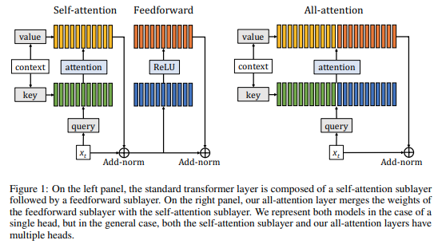</img>

https://arxiv.org/abs/1907.01470

Proposes adding learned memory key / values prior to attention. They were able to remove feedforwards altogether and attain similar performance to the original transformers. I have found that keeping the feedforwards and adding the memory key / values leads to even better performance.

```python
from x_transformers import Decoder, Encoder

enc = Encoder(
    dim = 512,
    depth = 6,
    heads = 8,
    attn_num_mem_kv = 16 # 16 memory key / values
)
```

### Memory Transformers

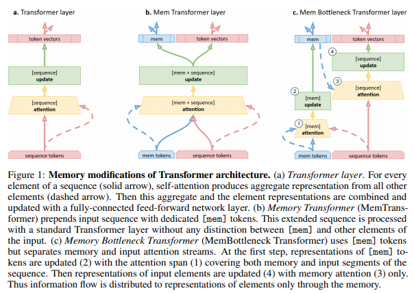</img>

https://arxiv.org/abs/2006.11527

Proposes adding learned tokens, akin to CLS tokens, named memory tokens, that is passed through the attention layers alongside the input tokens.

```python
import torch
from x_transformers import TransformerWrapper, Decoder, Encoder

model = TransformerWrapper(
    num_tokens = 20000,
    max_seq_len = 1024,
    num_memory_tokens = 20, # 20 memory tokens
    attn_layers = Encoder(
        dim = 512,
        depth = 6,
        heads = 8
    )
)
```

### Transformers Without Tears

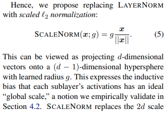</img>

https://arxiv.org/abs/1910.05895

They experiment with alternatives to Layer normalization and found one that is both effective and simpler. Researchers have shared with me this leads to faster convergence.

```python
import torch
from x_transformers import TransformerWrapper, Decoder, Encoder

model = TransformerWrapper(
    num_tokens = 20000,
    max_seq_len = 1024,
    attn_layers = Decoder(
        dim = 512,
        depth = 6,
        heads = 8,
        use_scalenorm = True # set to true to use for all layers
    )
)
```

### GLU Variants Improve Transformer

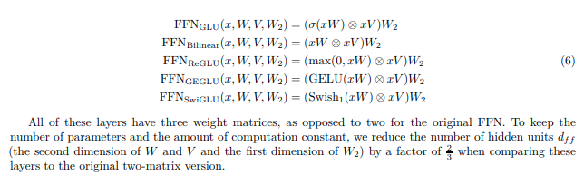</img>

https://arxiv.org/abs/2002.05202

Noam Shazeer paper that explores gating in the feedforward, finding that simple gating with GELU leads to significant improvements. This variant also showed up in the latest mT5 architecture. You should always turn this on (I may eventually turn it on by default).

```python
import torch
from x_transformers import TransformerWrapper, Decoder, Encoder

model = TransformerWrapper(
    num_tokens = 20000,
    max_seq_len = 1024,
    attn_layers = Decoder(
        dim = 512,
        depth = 6,
        heads = 8,
        ff_glu = True # set to true to use for all feedforwards
    )
)
```

### Rezero Is All You Need

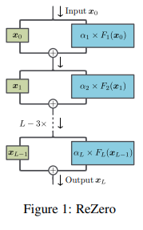</img>

https://arxiv.org/abs/2003.04887

This paper proposes to do away with normalization altogether, and instead gate the output of each branch with a single learned scalar, initialized at zero. They demonstrate convergence for very deep networks, convolution or attention, all without normalization.

I have had good results on usual datasets, but had met trouble with convergence on large datasets (GPT3 sized datasets). However, enough researchers have told me they had positive experiences with this that I decided to include it. If you run into trouble, please use Scalenorm instead.

```python
import torch
from x_transformers import TransformerWrapper, Decoder, Encoder

model = TransformerWrapper(
    num_tokens = 20000,
    max_seq_len = 1024,
    attn_layers = Decoder(
        dim = 512,
        depth = 6,
        heads = 8,
        use_rezero = True # set to true to use for all layers
    )
)
```

### Explicit Sparse Transformer: Concentrated Attention Through Explicit Selection

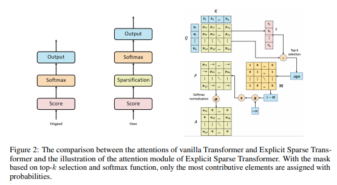</img>

https://arxiv.org/abs/1912.11637

This paper proposes an efficient way to sparsify attention by zeroing all dot-product query/key values not within the top k values. The show that this cheap method was as effective as other more expensive operations like sparsemax or entmax15. This technique comes with the cost of an extra hyperparameter (the top k values to keep). The paper recommends a value of `k = 8`

```python
import torch
from x_transformers import TransformerWrapper, Decoder, Encoder

model = TransformerWrapper(
    num_tokens = 20000,
    max_seq_len = 1024,
    attn_layers = Decoder(
        dim = 512,
        depth = 6,
        heads = 8,
        attn_sparse_topk = 8 # keep only the top 8 values before attention (softmax)
    )
)
```

Alternatively, if you would like to use `entmax15`, you can also do so with one setting as shown below.

```python
import torch
from x_transformers import TransformerWrapper, Decoder, Encoder

model = TransformerWrapper(
    num_tokens = 20000,
    max_seq_len = 1024,
    attn_layers = Decoder(
        dim = 512,
        depth = 6,
        heads = 8,
        attn_use_entmax15 = True  # use entmax15 for attention step
    )
)
```

### Talking-Heads Attention

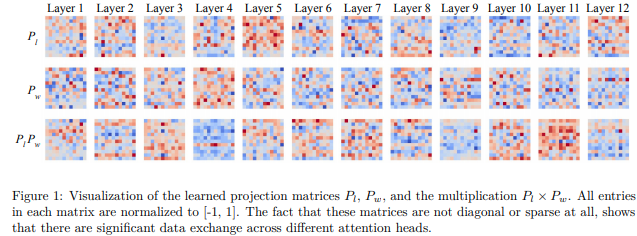</img>

https://arxiv.org/abs/2003.02436

A Noam Shazeer paper that proposes mixing information between heads pre and post attention (softmax). This comes with the cost of extra memory and compute.

```python
import torch
from x_transformers import TransformerWrapper, Decoder, Encoder

model = TransformerWrapper(
    num_tokens = 20000,
    max_seq_len = 1024,
    attn_layers = Decoder(
        dim = 512,
        depth = 6,
        heads = 8,
        attn_talking_heads = True  # turn on information exchange between attention heads
    )
)
```

### Attention on Attention for Image Captioning

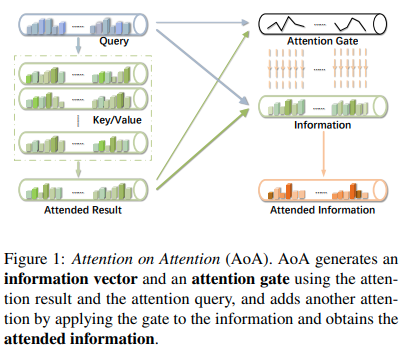</img>

https://arxiv.org/abs/1908.06954

This paper proposes to add a gated linear unit at the end of the attention layer, further gated by the original queries. Although this is not widely used outside of visual question / answering, I suspect it should lead to improvements after seeing the success of the feedforward GLU variant.

Update: After some experimentation, I found this variant actually performs worse, but if it were to be modified to not concatenate the queries before gating, it performs much better. That is what we will be using in this repository.

```python
import torch
from x_transformers import TransformerWrapper, Decoder, Encoder

model = TransformerWrapper(
    num_tokens = 20000,
    max_seq_len = 1024,
    attn_layers = Encoder(
        dim = 512,
        depth = 6,
        heads = 8,
        attn_on_attn = True  # gate output of attention layer, by queries
    )
)
```

### Improving Transformer Models by Reordering their Sublayers

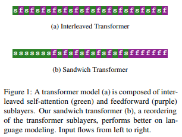</img>

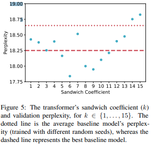</img>

https://arxiv.org/abs/1911.03864

This paper proposes to break from the normal fixed pattern of alternating attention and feedforwards, but to have blocks of only attention at the beginning followed by blocks of feedforwards at the end. This was further corroborated by a paper by Nvidia that reduces the number of attention layers to be 1/3rd of the feedforwards without loss in performance.

The amount of interleaving is controlled by a "sandwich coefficient", which they found to be optimal at a value of `6`.

You can experiment with this feature as shown below

```python
import torch
from x_transformers import TransformerWrapper, Decoder, Encoder

model = TransformerWrapper(
    num_tokens = 20000,
    max_seq_len = 1024,
    attn_layers = Encoder(
        dim = 512,
        depth = 6,
        heads = 8,
        sandwich_coef = 6  # interleave attention and feedforwards with sandwich coefficient of 6
    )
)
```

### Understanding and Improving Transformer From a Multi-Particle Dynamic System Point of View

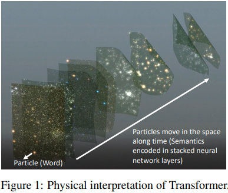</img>

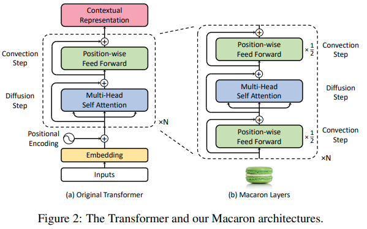</img>

https://arxiv.org/abs/1906.02762

The authors propose to view the success of transformers from a dynamical systems point of view, and then proposes an improvement based on mathematics of that POV. Specifically, they propose to place the attention layer in between two feedforward layers. This was adopted by a paper using transformers for speech recognition, the <a href="https://arxiv.org/abs/2005.08100">Conformer</a>.

```python
import torch
from x_transformers import TransformerWrapper, Decoder, Encoder

model = TransformerWrapper(
    num_tokens = 20000,
    max_seq_len = 1024,
    attn_layers = Encoder(
        dim = 512,
        depth = 6,
        heads = 8,
        macaron = True  # use macaron configuration
    )
)
```

### T5's Simplified Relative Positional Encoding

https://arxiv.org/abs/1910.10683

T5 is one of the most successful encoder / decoder transformer architectures trained to date. They invented a new simplified relative positional encoding based on learned bias values that are added to the attention matrix pre-softmax. This bias is shared and injected into each attention layer. I have decided to include this because it offers a cheap way to have relative positional encoding (superior to absolute positional), and I have read papers that suggest having positional encoding added to each layer (vs only before the first) is beneficial.

```python
import torch
from x_transformers import TransformerWrapper, Decoder

model = TransformerWrapper(
    num_tokens = 20000,
    max_seq_len = 1024,
    attn_layers = Decoder(
        dim = 512,
        depth = 6,
        heads = 8,
        rel_pos_bias = True  # adds relative positional bias to all attention layers, a la T5
    )
)
```

### Position Infused Attention

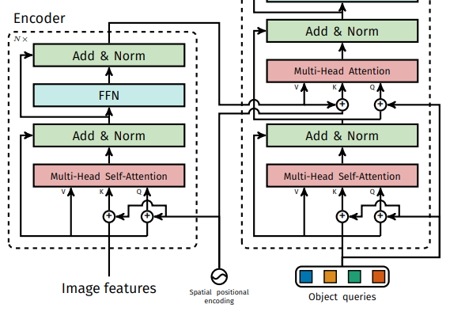</img>

https://arxiv.org/abs/2005.12872

https://ofir.io/shortformer.pdf

In these two papers, the authors independently figured out a new technique where fixed sinusoidal positional embeddings are injected into the input prior to the queries and keys projection for all layers, leading to "position infused" attention, but leaving the actual tokens (values) uncolored by positional embedding. The Shortformer paper uses this property to cache the tokens for simplified recurrent type of transformer that bested Transformer-XL.

I have tested this, and found that it produces better results than plain absolute positional encoding, even in the absence of recurrence. However, I have found that the T5 relative positional bias (also injected into all layers and has the same properties as PIA) performs even better. So given the option, you should just go with T5's `rel_pos_bias` above.

```python
import torch
from x_transformers import TransformerWrapper, Decoder

model = TransformerWrapper(
    num_tokens = 20000,
    max_seq_len = 1024,
    attn_layers = Decoder(
        dim = 512,
        depth = 6,
        heads = 8,
        position_infused_attn = True  # turns on position infused attention
    )
)
```

### Residual Attention

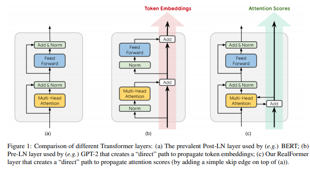</img>

https://arxiv.org/abs/2012.11747

This paper from Google proposes residualizing the pre-attention scores across all layers. At the cost of no extra parameters, they show improvement on top of regular attention networks. If you turn on this setting, be aware that the best results in the paper used post-normalization, in which case a learning warmup will be needed. The authors also reported that they could use a higher learning rate and get even better gains in the same amount of steps. (In the paper they use `2e-4` vs `1e-4` for vanilla transformer)

```python
import torch
from x_transformers import TransformerWrapper, Encoder

model = TransformerWrapper(
    num_tokens = 20000,
    max_seq_len = 1024,
    attn_layers = Encoder(
        dim = 512,
        depth = 6,
        heads = 8,
        pre_norm = False,       # in the paper, residual attention had best results with post-layernorm
        residual_attn = True    # add residual attention
    )
)
```

I also tried residualizing cross attention and may have noticed an improvement in convergence. You can try it by setting the `cross_residual_attn` keyword to `True`

```python
import torch
from x_transformers import XTransformer

model = XTransformer(
    dim = 512,
    enc_num_tokens = 256,
    enc_depth = 6,
    enc_heads = 8,
    enc_max_seq_len = 1024,
    dec_num_tokens = 256,
    dec_depth = 6,
    dec_heads = 8,
    dec_max_seq_len = 1024,
    dec_cross_residual_attn = True     # residualize cross attention
)
```

### Transformer-XL recurrence

You can also do Transformer-XL recurrence, by simply passing in a `max_mem_len` in the `TransformerWrapper` class, and then making sure your `Decoder` has `rel_pos_bias` set to `True`.

Then, you can retrieve the memories at each step with the `return_mems` keyword and pass it to the next iteration.

```python
import torch
from x_transformers import TransformerWrapper, Decoder

model_xl = TransformerWrapper(
    num_tokens = 20000,
    max_seq_len = 512,
    max_mem_len = 2048,
    attn_layers = Decoder(
        dim = 512,
        depth = 6,
        heads = 8,
        rel_pos_bias = True
    )
)

seg1 = torch.randint(0, 20000, (1, 512))
seg2 = torch.randint(0, 20000, (1, 512))
seg3 = torch.randint(0, 20000, (1, 512))

logits1, mems1  = model_xl(seg1, return_mems = True)
logits2, mems2  = model_xl(seg2, mems = mems1, return_mems = True)
logits3, mems3  = model_xl(seg3, mems = mems2, return_mems = True)
```

### Gated residual

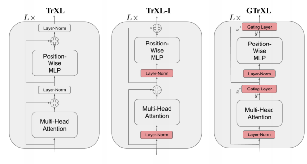</img>

https://arxiv.org/abs/1910.06764

The authors propose gating the residual connections in the transformer network and demonstrate increased stability and performance for Transformer-XL in a variety of reinforcement learning tasks.

```python
import torch
from x_transformers import TransformerWrapper, Decoder

model = TransformerWrapper(
    num_tokens = 20000,
    max_seq_len = 1024,
    max_mem_len = 2048,
    attn_layers = Decoder(
        dim = 512,
        depth = 6,
        heads = 16,
        gate_residual = True
    )
)
```

## Todo

To be explained and documented

- [x] ~~memory key / values - All-attention paper~~
- [x] ~~memory tokens - Memory Transformers~~
- [x] ~~scale normalization - Transformers Without Tears~~
- [x] ~~feedforward gated linear variant - Noam's GLU Variants~~
- [x] ~~rezero - Rezero is all you need~~
- [x] ~~topk attention - Explicit Sparse Attention~~
- [x] ~~entmax15 instead of softmax - Adaptively Sparse Transformers~~
- [x] ~~mixing head information - Noam's Talking Heads~~
- [x] ~~gating multi-head attention output -  Attention on Attention~~
- [x] ~~simplified relative positional encoding bias - T5~~
- [x] ~~sandwich transformer - Reordering Sublayers~~
- [x] ~~wrapper for processing images - Vision Transformer~~
- [x] ~~macaron layers - 'Multi-particle Dynamic System' paper~~
- [x] ~~residual attention - Realformer paper~~
- [x] ~~position infused attention - Shortformer paper~~
- [x] ~~recurrence - Transformer-XL~~
- [x] ~~gated transformer-xl - Stabilizing Transformers for RL~~
- [ ] reversibility - Reformer

## Miscellaneous

Cross Attention

```python
import torch
from x_transformers import Encoder, CrossAttender

enc = Encoder(dim = 512, depth = 6)
model = CrossAttender(dim = 512, depth = 6)

nodes = torch.randn(1, 1, 512)
node_masks = torch.ones(1, 1).bool()

neighbors = torch.randn(1, 5, 512)
neighbor_masks = torch.ones(1, 5).bool()

encoded_neighbors = enc(neighbors, mask = neighbor_masks)
model(nodes, context = encoded_neighbors, mask = node_masks, context_mask = neighbor_masks) # (1, 1, 512)

```

Pass in continuous values

```python
import torch
from x_transformers import ContinuousTransformerWrapper, Decoder

model = ContinuousTransformerWrapper(
    dim_in = 32,
    dim_out = 100,
    max_seq_len = 1024,
    attn_layers = Decoder(
        dim = 512,
        depth = 12,
        heads = 8
    )
)

x = torch.randn((1, 1024, 32))
mask = torch.ones(1, 1024).bool()

model(x, mask = mask) # (1, 1024, 100)
```

## Citations

```bibtex
@misc{vaswani2017attention,
    title   = {Attention Is All You Need},
    author  = {Ashish Vaswani and Noam Shazeer and Niki Parmar and Jakob Uszkoreit and Llion Jones and Aidan N. Gomez and Lukasz Kaiser and Illia Polosukhin},
    year    = {2017},
    eprint  = {1706.03762},
    archivePrefix = {arXiv},
    primaryClass = {cs.CL}
}
```

```bibtex
@inproceedings{kitaev2020reformer,
    title       = {Reformer: The Efficient Transformer},
    author      = {Nikita Kitaev and Lukasz Kaiser and Anselm Levskaya},
    booktitle   = {International Conference on Learning Representations},
    year        = {2020},
    url         = {https://openreview.net/forum?id=rkgNKkHtvB}
}
```

```bibtex
@article{DBLP:journals/corr/abs-1907-01470,
    author    = {Sainbayar Sukhbaatar and
               Edouard Grave and
               Guillaume Lample and
               Herv{\'{e}} J{\'{e}}gou and
               Armand Joulin},
    title     = {Augmenting Self-attention with Persistent Memory},
    journal   = {CoRR},
    volume    = {abs/1907.01470},
    year      = {2019},
    url       = {http://arxiv.org/abs/1907.01470}
}
```

```bibtex
@article{1910.05895,
    author  = {Toan Q. Nguyen and Julian Salazar},
    title   = {Transformers without Tears: Improving the Normalization of Self-Attention},
    year    = {2019},
    eprint  = {arXiv:1910.05895},
    doi     = {10.5281/zenodo.3525484},
}
```

```bibtex
@misc{shazeer2020glu,
    title   = {GLU Variants Improve Transformer},
    author  = {Noam Shazeer},
    year    = {2020},
    url     = {https://arxiv.org/abs/2002.05202}    
}
```

```bibtex
@misc{bachlechner2020rezero,
    title   = {ReZero is All You Need: Fast Convergence at Large Depth},
    author  = {Thomas Bachlechner and Bodhisattwa Prasad Majumder and Huanru Henry Mao and Garrison W. Cottrell and Julian McAuley},
    year    = {2020},
    url     = {https://arxiv.org/abs/2003.04887}
}
```

```bibtex
@misc{bhojanapalli2020lowrank,
    title   = {Low-Rank Bottleneck in Multi-head Attention Models},
    author  = {Srinadh Bhojanapalli and Chulhee Yun and Ankit Singh Rawat and Sashank J. Reddi and Sanjiv Kumar},
    year    = {2020},
    eprint  = {2002.07028}
}
```

```bibtex
@misc{burtsev2020memory,
    title   = {Memory Transformer}, 
    author  = {Mikhail S. Burtsev and Grigory V. Sapunov},
    year    = {2020},
    eprint  = {2006.11527},
    archivePrefix = {arXiv},
    primaryClass = {cs.CL}
}
```

```bibtex
@misc{zhao2019explicit,
    title   = {Explicit Sparse Transformer: Concentrated Attention Through Explicit Selection}, 
    author  = {Guangxiang Zhao and Junyang Lin and Zhiyuan Zhang and Xuancheng Ren and Qi Su and Xu Sun},
    year    = {2019},
    eprint  = {1912.11637},
    archivePrefix = {arXiv},
    primaryClass = {cs.CL}
}
```

```bibtex
@misc{correia2019adaptively,
    title   = {Adaptively Sparse Transformers},
    author  = {Gonçalo M. Correia and Vlad Niculae and André F. T. Martins},
    year    = {2019},
    eprint  = {1909.00015},
    archivePrefix = {arXiv},
    primaryClass = {cs.CL}
}
```

```bibtex
@misc{shazeer2020talkingheads,
    title   = {Talking-Heads Attention}, 
    author  = {Noam Shazeer and Zhenzhong Lan and Youlong Cheng and Nan Ding and Le Hou},
    year    = {2020},
    eprint  = {2003.02436},
    archivePrefix = {arXiv},
    primaryClass = {cs.LG}
}
```

```bibtex
@misc{press2020improving,
    title   = {Improving Transformer Models by Reordering their Sublayers}, 
    author  = {Ofir Press and Noah A. Smith and Omer Levy},
    year    = {2020},
    eprint  = {1911.03864},
    archivePrefix = {arXiv},
    primaryClass = {cs.CL}
}
```

```bibtex
@misc{lu2019understanding,
    title   = {Understanding and Improving Transformer From a Multi-Particle Dynamic System Point of View}, 
    author  = {Yiping Lu and Zhuohan Li and Di He and Zhiqing Sun and Bin Dong and Tao Qin and Liwei Wang and Tie-Yan Liu},
    year    = {2019},
    eprint  = {1906.02762},
    archivePrefix = {arXiv},
    primaryClass = {cs.LG}
}
```

```bibtex
@misc{ke2020rethinking,
    title     = {Rethinking Positional Encoding in Language Pre-training},
    author    = {Guolin Ke and Di He and Tie-Yan Liu},
    year      = {2020},
    eprint    = {2006.15595},
    archivePrefix = {arXiv},
    primaryClass = {cs.CL}
}
```

```bibtex
@misc{dosovitskiy2020image,
    title   = {An Image is Worth 16x16 Words: Transformers for Image Recognition at Scale},
    author  = {Alexey Dosovitskiy and Lucas Beyer and Alexander Kolesnikov and Dirk Weissenborn and Xiaohua Zhai and Thomas Unterthiner and Mostafa Dehghani and Matthias Minderer and Georg Heigold and Sylvain Gelly and Jakob Uszkoreit and Neil Houlsby},
    year    = {2020},
    eprint  = {2010.11929},
    archivePrefix = {arXiv},
    primaryClass = {cs.CV}
}
```

```bibtex
@misc{huang2019attention,
    title   = {Attention on Attention for Image Captioning},
    author  = {Lun Huang and Wenmin Wang and Jie Chen and Xiao-Yong Wei},
    year    = {2019},
    eprint  = {1908.06954},
    archivePrefix = {arXiv},
    primaryClass = {cs.CV}
}
```

```bibtex
@misc{raffel2020exploring,
    title   = {Exploring the Limits of Transfer Learning with a Unified Text-to-Text Transformer}, 
    author  = {Colin Raffel and Noam Shazeer and Adam Roberts and Katherine Lee and Sharan Narang and Michael Matena and Yanqi Zhou and Wei Li and Peter J. Liu},
    year    = {2020},
    eprint  = {1910.10683},
    archivePrefix = {arXiv},
    primaryClass = {cs.LG}
}
```

```bibtex
@inproceedings{martins-etal-2020-sparse,
    title   = "Sparse Text Generation",
    author  = "Martins, Pedro Henrique  and
        Marinho, Zita  and
        Martins, Andr{\'e} F. T.",
    booktitle = "Proceedings of the 2020 Conference on Empirical Methods in Natural Language Processing (EMNLP)",
    month   = nov,
    year    = "2020",
    address = "Online",
    publisher = "Association for Computational Linguistics",
    url     = "https://www.aclweb.org/anthology/2020.emnlp-main.348"
}
```

```bibtex
@misc{he2020realformer,
    title   = {RealFormer: Transformer Likes Residual Attention},
    author  = {Ruining He and Anirudh Ravula and Bhargav Kanagal and Joshua Ainslie},
    year    = {2020},
    eprint  = {2012.11747},
    archivePrefix = {arXiv},
    primaryClass = {cs.LG}
}
```

```bibtex
@misc{carion2020endtoend,
    title   = {End-to-End Object Detection with Transformers},
    author  = {Nicolas Carion and Francisco Massa and Gabriel Synnaeve and Nicolas Usunier and Alexander Kirillov and Sergey Zagoruyko},
    year    = {2020},
    eprint  = {2005.12872},
    archivePrefix = {arXiv},
    primaryClass = {cs.CV}
}
```

```bibtex
@misc{press2020shortformer,
    title   = {Shortformer: Better Language Modeling using Shorter Inputs},
    author  = {Ofir Press and Noah A. Smith and Mike Lewis},
    year    = {2020}
}
```

```bibtex
@misc{parisotto2019stabilizing,
      title     = {Stabilizing Transformers for Reinforcement Learning},
      author    = {Emilio Parisotto and H. Francis Song and Jack W. Rae and Razvan Pascanu and Caglar Gulcehre and Siddhant M. Jayakumar and Max Jaderberg and Raphael Lopez Kaufman and Aidan Clark and Seb Noury and Matthew M. Botvinick and Nicolas Heess and Raia Hadsell},
      year      = {2019},
      eprint    = {1910.06764},
      archivePrefix = {arXiv},
      primaryClass = {cs.LG}
}
```

```bibtex
@misc{narang2021transformer,
    title       = {Do Transformer Modifications Transfer Across Implementations and Applications?},
    author      = {Sharan Narang and Hyung Won Chung and Yi Tay and William Fedus and Thibault Fevry and Michael Matena and Karishma Malkan and Noah Fiedel and Noam Shazeer and Zhenzhong Lan and Yanqi Zhou and Wei Li and Nan Ding and Jake Marcus and Adam Roberts and Colin Raffel},
    year        = {2021},
    eprint      = {2102.11972},
    archivePrefix = {arXiv},
    primaryClass = {cs.LG}
}
```

```bibtex
@misc{zhang2019root,
    title   = {Root Mean Square Layer Normalization},
    author  = {Biao Zhang and Rico Sennrich},
    year    = {2019},
    eprint  = {1910.07467},
    archivePrefix = {arXiv},
    primaryClass = {cs.LG}
}
```

```bibtex
@techreport{zhuiyiroformer,
    title   = {RoFormer: Transformer with Rotary Position Embeddings - ZhuiyiAI},
    author  = {Jianlin Su},
    year    = {2021},
    url     = "https://github.com/ZhuiyiTechnology/roformer",
}
```

*solve intelligence... then use that to solve everything else.* - Demis Hassabis
