## x-transformers

[](https://badge.fury.io/py/x-transformers)

A concise but fully-featured transformer, complete with a set of promising e**x**perimental features from various papers.

## Install

```bash
$ pip install x-transformers
```

## Usage

Full encoder / decoder

```python
import torch
from x_transformers import XTransformer

model = XTransformer(
    dim = 512,
    enc_num_tokens = 256,
    enc_depth = 6,
    enc_heads = 8,
    enc_max_seq_len = 1024,
    dec_num_tokens = 256,
    dec_depth = 6,
    dec_heads = 8,
    dec_max_seq_len = 1024,
    tie_token_emb = True      # tie embeddings of encoder and decoder
)

src = torch.randint(0, 256, (1, 1024))
src_mask = torch.ones_like(src).bool()
tgt = torch.randint(0, 256, (1, 1024))

loss = model(src, tgt, mask = src_mask) # (1, 1024, 512)
loss.backward()
```

Decoder-only (GPT-like)

```python
import torch
from x_transformers import TransformerWrapper, Decoder

model = TransformerWrapper(
    num_tokens = 20000,
    max_seq_len = 1024,
    attn_layers = Decoder(
        dim = 512,
        depth = 12,
        heads = 8
    )
).cuda()

x = torch.randint(0, 256, (1, 1024)).cuda()

model(x) # (1, 1024, 20000)
```

GPT3 would be approximately the following (but you wouldn't be able to run it anyways)

```python

gpt3 = TransformerWrapper(
    num_tokens = 50000,
    max_seq_len = 2048,
    attn_layers = Decoder(
        dim = 12288,
        depth = 96,
        heads = 96,
        attn_dim_head = 128
    )
).cuda()
```

Encoder-only (BERT-like)

```python
import torch
from x_transformers import TransformerWrapper, Encoder

model = TransformerWrapper(
    num_tokens = 20000,
    max_seq_len = 1024,
    attn_layers = Encoder(
        dim = 512,
        depth = 12,
        heads = 8
    )
).cuda()

x = torch.randint(0, 256, (1, 1024)).cuda()
mask = torch.ones_like(x).bool()

model(x, mask = mask) # (1, 1024, 20000)
```

State of the art image classification

```python
import torch
from x_transformers import ViTransformerWrapper, Encoder

model = ViTransformerWrapper(
    image_size = 256,
    patch_size = 32,
    num_classes = 1000,
    attn_layers = Encoder(
        dim = 512,
        depth = 6,
        heads = 8,
    )
)

img = torch.randn(1, 3, 256, 256)
model(img) # (1, 1000)
```

Image -> caption

```python
import torch
from x_transformers import ViTransformerWrapper, TransformerWrapper, Encoder, Decoder

encoder = ViTransformerWrapper(
    image_size = 256,
    patch_size = 32,
    attn_layers = Encoder(
        dim = 512,
        depth = 6,
        heads = 8
    )
)

decoder = TransformerWrapper(
    num_tokens = 20000,
    max_seq_len = 1024,
    attn_layers = Decoder(
        dim = 512,
        depth = 6,
        heads = 8,
        cross_attend = True
    )
)

img = torch.randn(1, 3, 256, 256)
caption = torch.randint(0, 20000, (1, 1024))

encoded = encoder(img, return_embeddings = True)
decoder(caption, context = encoded) # (1, 1024, 20000)
```

<a href="https://arxiv.org/abs/2209.06794">PaLI</a>, state of the art language-vision model

```python
import torch
from x_transformers import ViTransformerWrapper, XTransformer, Encoder

# PaLI composes of
# 1. vision transformer (ViTransformerWrapper) +
# 2. encoder-decoder transformer (XTransformer)

vit = ViTransformerWrapper(
    image_size = 256,
    patch_size = 32,
    attn_layers = Encoder(
        dim = 512,
        depth = 6,
        heads = 8
    )
)

pali = XTransformer(
    dim = 512,
    enc_num_tokens = 256,
    enc_depth = 6,
    enc_heads = 8,
    enc_max_seq_len = 1024,
    dec_num_tokens = 256,
    dec_depth = 6,
    dec_heads = 8,
    dec_max_seq_len = 1024
)

# training data

img = torch.randn(1, 3, 256, 256)               # images
prompt = torch.randint(0, 256, (1, 1024))       # prompt
prompt_mask = torch.ones(1, 1024).bool()        # prompt text mask
output_text = torch.randint(0, 256, (1, 1024))  # target output text

# train

img_embeds = vit(
    img,
    return_embeddings = True
)

loss = pali(
    prompt,
    output_text,
    mask = prompt_mask,
    src_prepend_embeds = img_embeds             # will preprend image embeddings to encoder text embeddings before attention
)

loss.backward()

# do the above for many steps on a 17B parameter model
# attention is all you need
```

## Dropouts

```python
import torch
from x_transformers import TransformerWrapper, Decoder, Encoder

model = TransformerWrapper(
    num_tokens = 20000,
    max_seq_len = 1024,
    emb_dropout = 0.1,         # dropout after embedding
    attn_layers = Decoder(
        dim = 512,
        depth = 6,
        heads = 8,
        layer_dropout = 0.1,   # stochastic depth - dropout entire layer
        attn_dropout = 0.1,    # dropout post-attention
        ff_dropout = 0.1       # feedforward dropout
    )
)

x = torch.randint(0, 20000, (1, 1024))
model(x)
```

## Features

### Augmenting Self-attention with Persistent Memory

</img>

https://arxiv.org/abs/1907.01470

Proposes adding learned memory key / values prior to attention. They were able to remove feedforwards altogether and attain similar performance to the original transformers. I have found that keeping the feedforwards and adding the memory key / values leads to even better performance.

```python
from x_transformers import Decoder, Encoder

enc = Encoder(
    dim = 512,
    depth = 6,
    heads = 8,
    attn_num_mem_kv = 16 # 16 memory key / values
)
```

### Memory Transformers

</img>

https://arxiv.org/abs/2006.11527

Proposes adding learned tokens, akin to CLS tokens, named memory tokens, that is passed through the attention layers alongside the input tokens.

```python
import torch
from x_transformers import TransformerWrapper, Decoder, Encoder

model = TransformerWrapper(
    num_tokens = 20000,
    max_seq_len = 1024,
    num_memory_tokens = 20, # 20 memory tokens
    attn_layers = Encoder(
        dim = 512,
        depth = 6,
        heads = 8
    )
)
```

### Transformers Without Tears

</img>

https://arxiv.org/abs/1910.05895

They experiment with alternatives to Layer normalization and found one that is both effective and simpler. Researchers have shared with me this leads to faster convergence.

```python
import torch
from x_transformers import TransformerWrapper, Decoder, Encoder

model = TransformerWrapper(
    num_tokens = 20000,
    max_seq_len = 1024,
    attn_layers = Decoder(
        dim = 512,
        depth = 6,
        heads = 8,
        use_scalenorm = True # set to True to use for all layers
    )
)
```

You can also use the l2 normalized embeddings proposed as part of `fixnorm`. I have found it leads to improved convergence, when paired with small initialization (proposed by <a href="https://github.com/BlinkDL">BlinkDL</a>). The small initialization will be taken care of as long as `l2norm_embed` is set to `True`

```python
import torch
from x_transformers import TransformerWrapper, Decoder, Encoder

model = TransformerWrapper(
    num_tokens = 20000,
    max_seq_len = 1024,
    l2norm_embed = True,    # set this to True for l2 normalized embedding + small init
    attn_layers = Decoder(
        dim = 512,
        depth = 6,
        heads = 8
    )
)
```

Along the same lines of l2 normalized embeddings, Huggingface's <a href="https://huggingface.co/bigscience/bloom">175B parameter BLOOM</a> also places a layernorm right after the embeddings and just before the tokens enter the attention layers. This was corroborated by Yandex's <a href="https://github.com/yandex/YaLM-100B">100B parameter YaLM</a> to stabilize training.

It is recommended you either have either `l2norm_embed` or `post_emb_norm` set to `True` but not both, as they probably serve the same purpose.

```python
import torch
from x_transformers import TransformerWrapper, Decoder, Encoder

model = TransformerWrapper(
    num_tokens = 20000,
    max_seq_len = 1024,
    post_emb_norm = True,    # set this to True to layernorm summed token + pos embeddings
    attn_layers = Decoder(
        dim = 512,
        depth = 6,
        heads = 8
    )
)
```

### Root Mean Square Layer Normalization

https://arxiv.org/abs/1910.07467

The authors propose to replace layer normalization with a simpler alternative, without mean centering and the learned bias. An investigative paper found this to be the <a href="https://arxiv.org/abs/2102.11972">best performing normalization variant</a>. It was also used in Deepmind's latest large language models, <a href="https://deepmind.com/research/publications/2021/improving-language-models-by-retrieving-from-trillions-of-tokens">Retro</a> and <a href="https://arxiv.org/abs/2112.11446">Gopher</a>.

```python
import torch
from x_transformers import TransformerWrapper, Decoder, Encoder

model = TransformerWrapper(
    num_tokens = 20000,
    max_seq_len = 1024,
    attn_layers = Decoder(
        dim = 512,
        depth = 6,
        heads = 8,
        use_rmsnorm = True # set to true to use for all layers
    )
)
```

### GLU Variants Improve Transformer

</img>

https://arxiv.org/abs/2002.05202

Noam Shazeer paper that explores gating in the feedforward, finding that simple gating with GELU leads to significant improvements. This variant also showed up in the latest mT5 architecture. You should always turn this on (I may eventually turn it on by default).

```python
import torch
from x_transformers import TransformerWrapper, Decoder, Encoder

model = TransformerWrapper(
    num_tokens = 20000,
    max_seq_len = 1024,
    attn_layers = Decoder(
        dim = 512,
        depth = 6,
        heads = 8,
        ff_glu = True # set to true to use for all feedforwards
    )
)
```

The <a href="https://ai.googleblog.com/2022/04/pathways-language-model-palm-scaling-to.html">PaLM</a> language model also chose to use the Swish GLU variant. You can turn this on by setting two flags

```python
import torch
from x_transformers import TransformerWrapper, Decoder, Encoder

model = TransformerWrapper(
    num_tokens = 20000,
    max_seq_len = 1024,
    attn_layers = Decoder(
        dim = 512,
        depth = 6,
        heads = 8,
        ff_swish = True, # set this to True
        ff_glu = True    # set to true to use for all feedforwards
    )
)
``````

### ReLU²

https://arxiv.org/abs/2109.08668

This paper used neural architecture search and found an activation, Relu Squared, that is both simpler and performs better than GELU, in the autoregressive language model setting. I have confirmed this in my independent experiments. However, if one were using the GLU variant from above, GELU still performs better. Pending further corroboration.

```python
import torch
from x_transformers import TransformerWrapper, Decoder, Encoder

model = TransformerWrapper(
    num_tokens = 20000,
    max_seq_len = 1024,
    attn_layers = Decoder(
        dim = 512,
        depth = 6,
        heads = 8,
        ff_relu_squared = True
    )
)
```

### Explicit Sparse Transformer: Concentrated Attention Through Explicit Selection

</img>

https://arxiv.org/abs/1912.11637

This paper proposes an efficient way to sparsify attention by zeroing all dot-product query/key values not within the top k values. The show that this cheap method was as effective as other more expensive operations like sparsemax or entmax15. This technique comes with the cost of an extra hyperparameter (the top k values to keep). The paper recommends a value of `k = 8`

```python
import torch
from x_transformers import TransformerWrapper, Decoder

model = TransformerWrapper(
    num_tokens = 20000,
    max_seq_len = 1024,
    attn_layers = Decoder(
        dim = 512,
        depth = 6,
        heads = 8,
        attn_sparse_topk = 8 # keep only the top 8 values before attention (softmax)
    )
)
```

### Talking-Heads Attention

</img>

https://arxiv.org/abs/2003.02436

A Noam Shazeer paper that proposes mixing information between heads pre and post attention (softmax). This comes with the cost of extra memory and compute.

```python
import torch
from x_transformers import TransformerWrapper, Decoder

model = TransformerWrapper(
    num_tokens = 20000,
    max_seq_len = 1024,
    attn_layers = Decoder(
        dim = 512,
        depth = 6,
        heads = 8,
        attn_talking_heads = True  # turn on information exchange between attention heads
    )
)
```

### One Write-Head Is All You Need

https://arxiv.org/abs/1911.02150

Yet another Noam Shazeer paper (he's a legend) that proposes to only have one head for the key / values, but multi-headed queries. This paper was largely ignored for a while, but recently validated at scale in <a href="https://arxiv.org/abs/2203.07814">AlphaCode</a> as well as <a href="https://arxiv.org/abs/2204.02311">PaLM</a>. It has the property of being memory efficient when decoding extremely large language models. You can use it with one keyword argument as shown below.

```python
import torch
from x_transformers import TransformerWrapper, Decoder

model = TransformerWrapper(
    num_tokens = 20000,
    max_seq_len = 1024,
    attn_layers = Decoder(
        dim = 512,
        depth = 6,
        heads = 8,
        attn_one_kv_head = True
    )
)
```

### Attention on Attention for Image Captioning

</img>

https://arxiv.org/abs/1908.06954

This paper proposes to add a gated linear unit at the end of the attention layer, further gated by the original queries. Although this is not widely used outside of visual question / answering, I suspect it should lead to improvements after seeing the success of the feedforward GLU variant.

Update: After some experimentation, I found this variant actually performs worse, but if it were to be modified to not concatenate the queries before gating, it performs much better. That is what we will be using in this repository.

```python
import torch
from x_transformers import TransformerWrapper, Encoder

model = TransformerWrapper(
    num_tokens = 20000,
    max_seq_len = 1024,
    attn_layers = Encoder(
        dim = 512,
        depth = 6,
        heads = 8,
        attn_on_attn = True  # gate output of attention layer, by queries
    )
)
```

### Intra-attention Gating on Values

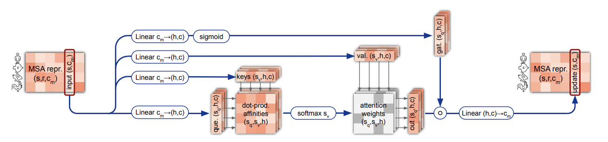</img>

<a href="https://github.com/deepmind/alphafold">Alphafold2</a> had a peculiar variant of attention where they gate the aggregated values with the input, presumably to have the block have more control over the update.

A quick test shows a small but noticeable improvement, on about the same order as attention on attention.

```python
import torch
from x_transformers import TransformerWrapper, Encoder

model = TransformerWrapper(
    num_tokens = 20000,
    max_seq_len = 1024,
    attn_layers = Encoder(
        dim = 512,
        depth = 6,
        heads = 8,
        attn_gate_values = True  # gate aggregated values with the input
    )
)
```

### Improving Transformer Models by Reordering their Sublayers

</img>

</img>

https://arxiv.org/abs/1911.03864

This paper proposes to break from the normal fixed pattern of alternating attention and feedforwards, but to have blocks of only attention at the beginning followed by blocks of feedforwards at the end. This was further corroborated by a paper by Nvidia that reduces the number of attention layers to be 1/3rd of the feedforwards without loss in performance.

The amount of interleaving is controlled by a "sandwich coefficient", which they found to be optimal at a value of `6`.

You can experiment with this feature as shown below

```python
import torch
from x_transformers import TransformerWrapper, Encoder

model = TransformerWrapper(
    num_tokens = 20000,
    max_seq_len = 1024,
    attn_layers = Encoder(
        dim = 512,
        depth = 6,
        heads = 8,
        sandwich_coef = 6  # interleave attention and feedforwards with sandwich coefficient of 6
    )
)
```

### Understanding and Improving Transformer From a Multi-Particle Dynamic System Point of View

</img>

</img>

https://arxiv.org/abs/1906.02762

The authors propose to view the success of transformers from a dynamical systems point of view, and then proposes an improvement based on mathematics of that POV. Specifically, they propose to place the attention layer in between two feedforward layers. This was adopted by a paper using transformers for speech recognition, the <a href="https://arxiv.org/abs/2005.08100">Conformer</a>.

```python
import torch
from x_transformers import TransformerWrapper, Encoder

model = TransformerWrapper(
    num_tokens = 20000,
    max_seq_len = 1024,
    attn_layers = Encoder(
        dim = 512,
        depth = 6,
        heads = 8,
        macaron = True  # use macaron configuration
    )
)
```

### T5's Simplified Relative Positional Encoding

https://arxiv.org/abs/1910.10683

T5 is one of the most successful encoder / decoder transformer architectures trained to date. They invented a new simplified relative positional encoding based on learned bias values that are added to the attention matrix pre-softmax. This bias is shared and injected into each attention layer. I have decided to include this because it offers a cheap way to have relative positional encoding (superior to absolute positional), and I have read papers that suggest having positional encoding added to each layer (vs only before the first) is beneficial.

```python
import torch
from x_transformers import TransformerWrapper, Decoder

model = TransformerWrapper(
    num_tokens = 20000,
    max_seq_len = 1024,
    attn_layers = Decoder(
        dim = 512,
        depth = 6,
        heads = 8,
        rel_pos_bias = True  # adds relative positional bias to all attention layers, a la T5
    )
)
```

### Residual Attention

</img>

https://arxiv.org/abs/2012.11747

This paper from Google proposes residualizing the pre-attention scores across all layers. At the cost of no extra parameters, they show improvement on top of regular attention networks. If you turn on this setting, be aware that the best results in the paper used post-normalization, in which case a learning warmup will be needed. The authors also reported that they could use a higher learning rate and get even better gains in the same amount of steps. (In the paper they use `2e-4` vs `1e-4` for vanilla transformer)

```python
import torch
from x_transformers import TransformerWrapper, Encoder

model = TransformerWrapper(
    num_tokens = 20000,
    max_seq_len = 1024,
    attn_layers = Encoder(
        dim = 512,
        depth = 6,
        heads = 8,
        pre_norm = False,       # in the paper, residual attention had best results with post-layernorm
        residual_attn = True    # add residual attention
    )
)
```

I also tried residualizing cross attention and may have noticed an improvement in convergence. You can try it by setting the `cross_residual_attn` keyword to `True`

```python
import torch
from x_transformers import XTransformer

model = XTransformer(
    dim = 512,
    enc_num_tokens = 256,
    enc_depth = 6,
    enc_heads = 8,
    enc_max_seq_len = 1024,
    dec_num_tokens = 256,
    dec_depth = 6,
    dec_heads = 8,
    dec_max_seq_len = 1024,
    dec_cross_residual_attn = True     # residualize cross attention
)
```

### Deepnorm

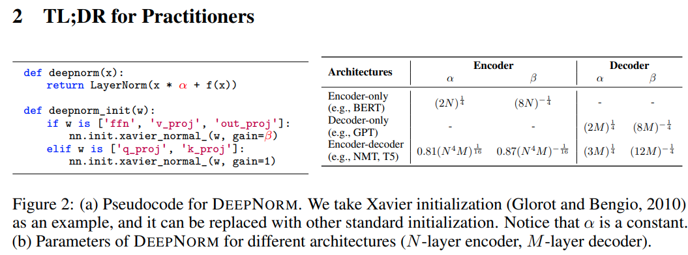</img>

It is well known that post-normalization transformers have trouble with stability, prompting the move to <a href="https://arxiv.org/abs/2002.04745">pre-normalization</a> in recent years, even though the latter sacrifices performance.

This paper out of Microsoft research proposes a way to fix post-normalization stability. They achieve this by simply scaling the residual and proper initialization. They show they can train an one thousand layer transformer without stability issues, and achieve better results than pre-normalization.

This was recently validated in a <a href="https://keg.cs.tsinghua.edu.cn/glm-130b/">130B GLM model</a> out of Tsinghua.


```python
import torch
from x_transformers import TransformerWrapper, Decoder

model = TransformerWrapper(
    num_tokens = 20000,
    max_seq_len = 1024,
    attn_layers = Decoder(
        deepnorm = True,     # set this to True to use deepnorm post-normalization configuration
        dim = 512,
        depth = 6,
        heads = 8
    )
)
```

### Transformer-XL recurrence

You can also do Transformer-XL recurrence, by simply passing in a `max_mem_len` in the `TransformerWrapper` class, and then making sure your `Decoder` has `rel_pos_bias` set to `True`.

Then, you can retrieve the memories at each step with the `return_mems` keyword and pass it to the next iteration.

```python
import torch
from x_transformers import TransformerWrapper, Decoder

model_xl = TransformerWrapper(
    num_tokens = 20000,
    max_seq_len = 512,
    max_mem_len = 2048,
    attn_layers = Decoder(
        dim = 512,
        depth = 6,
        heads = 8,
        rel_pos_bias = True
    )
)

seg1 = torch.randint(0, 20000, (1, 512))
seg2 = torch.randint(0, 20000, (1, 512))
seg3 = torch.randint(0, 20000, (1, 512))

logits1, mems1  = model_xl(seg1, return_mems = True)
logits2, mems2  = model_xl(seg2, mems = mems1, return_mems = True)
logits3, mems3  = model_xl(seg3, mems = mems2, return_mems = True)
```

### Enhanced recurrence

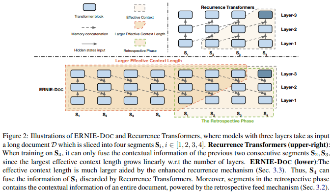

<a href="https://arxiv.org/abs/2012.15688">This paper</a> proposes a simple technique to enhance the range of Transformer-XL. They simply route the memory segment of a layer to the layer below it, for the next recurrent step. You can enable this by setting `shift_mem_down = 1`. You can also shift down arbitrary number of layers by setting this value to `> 1`.

```python
import torch
from x_transformers import TransformerWrapper, Decoder

model_xl = TransformerWrapper(
    num_tokens = 20000,
    max_seq_len = 512,
    max_mem_len = 2048,
    shift_mem_down = 1,
    attn_layers = Decoder(
        dim = 512,
        depth = 6,
        heads = 8,
        rotary_pos_emb = True
    )
)

seg1 = torch.randint(0, 20000, (1, 512))
seg2 = torch.randint(0, 20000, (1, 512))
seg3 = torch.randint(0, 20000, (1, 512))

logits1, mems1  = model_xl(seg1, return_mems = True)
logits2, mems2  = model_xl(seg2, mems = mems1, return_mems = True) # mems1 of layer N are automatically routed to the layer N-1
```

### Gated residual

</img>

https://arxiv.org/abs/1910.06764

The authors propose gating the residual connections in the transformer network and demonstrate increased stability and performance for Transformer-XL in a variety of reinforcement learning tasks.

```python
import torch
from x_transformers import TransformerWrapper, Decoder

model = TransformerWrapper(
    num_tokens = 20000,
    max_seq_len = 1024,
    max_mem_len = 2048,
    attn_layers = Decoder(
        dim = 512,
        depth = 6,
        heads = 16,
        gate_residual = True
    )
)
```

### Rotary Positional Embeddings

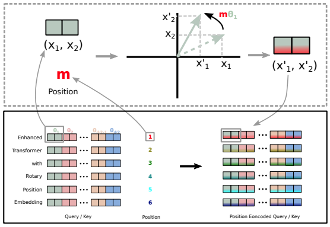</img>

Developed in Beijing, this new technique quickly gained interest in the NLP circles. In short, it allows you to endow the transformer with relative positional embeddings at the cost of no learned parameters. You apply a rotary operation to the queries and keys prior to their dot product in attention. The big idea is injecting positions through rotations.

Highly recommend that you have this turned on whenever you are working on an ordered sequence.

```python
import torch
from x_transformers import TransformerWrapper, Decoder

model = TransformerWrapper(
    num_tokens = 20000,
    max_seq_len = 1024,
    attn_layers = Decoder(
        dim = 512,
        depth = 6,
        heads = 8,
        rotary_pos_emb = True  # turns on rotary positional embeddings
    )
)
```

Update (12/2022): Rotary embedding has since been hugely successful, widely adopted in many large language models, including the largest in the world, PaLM. However, it has been uncovered in the ALiBi paper that rotary embeddings cannot length extrapolate well. This was recently addressed in <a href="https://arxiv.org/abs/2212.10554v1">a Microsoft research paper</a>. They propose a way to unobtrusively add the same decay as in ALiBi, and found that this resolves the extrapolation problem. You can use it in this repository by setting `rotary_xpos = True`. Like ALiBi, it would enforce the attention to be local. You can set the receptive field with `rotary_xpos_scale_base` value, which defaults to `512`

```python
import torch
from x_transformers import TransformerWrapper, Decoder

model = TransformerWrapper(
    num_tokens = 20000,
    max_seq_len = 1024,
    attn_layers = Decoder(
        dim = 512,
        depth = 6,
        heads = 8,
        rotary_xpos = True   # modified rotary to extrapolate well beyond length at which it was trained
    )
)
```

### Dynamic Positional Bias

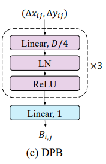</img>

This technique bears roots from the field of vision transformers, where researchers are trying to have relative positions generalize to larger resolutions (without having to retrain the entire network). It was used in two recent papers, <a href="https://arxiv.org/abs/2108.00154">CrossFormer</a>, as well as <a href="https://arxiv.org/abs/2111.09883">SwinV2</a>.

<a href="https://github.com/cfoster0">Charles Foster</a> first tried this for a language model, and found that it works. Later on <a href="https://github.com/bob80333">Eric Engelhart</a> produced experimental results that show the same type of extrapolation holds, even for 1d sequences.

Eric trained at sequence lengths of 128, and showed that it generalized well to 1024. In addition, he showed that linear positions was better than log (used in SwinV2), for language.

Linear distances

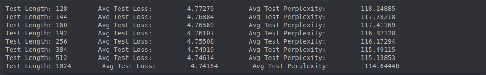</img>

Log distances

</img>

Negative control - Sinusoidal

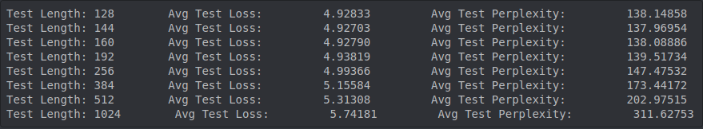</img>

More of Eric's experimental results can be found <a href="https://github.com/bob80333/investigating_extrapolation">here</a>

You can use this type of relative position if you wish to train at smaller sequence lengths and have it generalize to longer ones, for both autoregressive and bidirectional models.

```python
import torch
from x_transformers import TransformerWrapper, Decoder

model = TransformerWrapper(
    num_tokens = 256,
    max_seq_len = 1024,
    attn_layers = Decoder(
        dim = 512,
        depth = 6,
        heads = 8,
        dynamic_pos_bias = True,                # set this to True
        dynamic_pos_bias_log_distance = False   # whether to use log distance, as in SwinV2
    )
)
```


### ALiBi Positional Embedding

<a href="https://ofir.io/train_short_test_long.pdf">This paper</a> proposes to simply apply a static linear bias to the attention matrix. The authors show this is not only effective as a relative positional encoding, but also allows the attention net to extrapolate to greater sequences length than what it was trained on, for autoregressive language models.

This repository also offers a bidirectional variant (nonsymmetric), proposed by the authors <a href="https://github.com/ofirpress/attention_with_linear_biases/issues/5">here</a>. However, this is untested. If you need bidirectional length extrapolation, the safest option would be Dynamic Position Bias

Update: It may be that ALiBi enforces a strong local attention across the heads, and may hinder it from attending at distances greater than 1k. To avoid any issues with global message passing, I've decided to introduce another hyperparameter `alibi_num_heads`, so one can specify less heads for the ALiBi bias

Update: There are reports that ALiBi outperform Rotary embeddings for pretraining and downstream fine-tuning.

```python
import torch
from x_transformers import TransformerWrapper, Decoder

model = TransformerWrapper(
    num_tokens = 20000,
    max_seq_len = 1024,
    attn_layers = Decoder(
        dim = 512,
        depth = 6,
        heads = 8,
        alibi_pos_bias = True, # turns on ALiBi positional embedding
        alibi_num_heads = 4    # only use ALiBi for 4 out of the 8 heads, so other 4 heads can still attend far distances
    )
)
```

### Shifted Tokens

An <a href="https://github.com/BlinkDL">independent researcher</a> has found that shifting a subset of the feature dimension along the sequence dimension by 1 token helps with convergence (<a href="https://zhuanlan.zhihu.com/p/191393788">Time-mixing</a>). I have tested this for the autoregressive case and can confirm that it leads to greatly improved convergence. This also lines up with <a href="https://arxiv.org/abs/2106.07477">the results</a> of some papers in the vision domain.

To use it, simply set `shift_tokens = 1` (or to whatever number of shifts you desire). The feature dimension will be divided by `shift_tokens + 1` and then each chunk will be shifted `[0, shift_tokens]` respectively

Update: new experiments by @sdtblck suggests this may only work for character-level training

Update: after more experiments, it seems that in the context of BPE encoding, with rotary turned on, there is no benefit to shifting. for character-level training, shifting may still improve a tiny bit

Update: When doing BPE encoded tokens, it seems that shift of 2 will bottleneck the dimensions (divided by 5). It is recommended you always do a shift of 1, unless if you are working with character level.

```python
import torch
from x_transformers import TransformerWrapper, Decoder

model = TransformerWrapper(
    num_tokens = 20000,
    max_seq_len = 1024,
    attn_layers = Decoder(
        dim = 512,
        depth = 6,
        heads = 8,
        shift_tokens = 1
    )
)
```

If you want finer control over how much is shifted per block (whether attention or feedforward), simply pass in a tuple of size that is equal to the number of layers.

```python
import torch
from x_transformers import TransformerWrapper, Decoder

model = TransformerWrapper(
    num_tokens = 20000,
    max_seq_len = 1024,
    attn_layers = Decoder(
        dim = 512,
        depth = 6,
        heads = 8,
        shift_tokens = (1, 1, 1, 1, 1, 1, 0, 0, 0, 0, 0, 0) # 12 blocks, attention and feedforward alternating, with progressively less shifting
    )
)
```

### Sandwich Norm

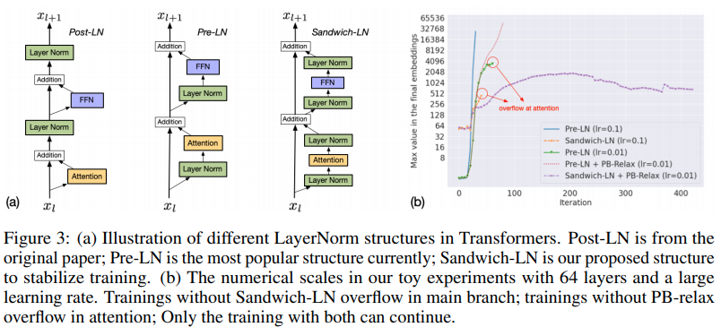

This technique first made an appearance in <a href="https://arxiv.org/abs/2105.13290">the CoqView paper</a>, a Chinese version of the famous text-to-image transformer DALL-E. They propose, when using pre-layernorm, to add an extra layernorm to all the branch outputs. I have found this to be very effective for a number of projects, when facing instability during training.

```python
import torch
from x_transformers import TransformerWrapper, Decoder

model = TransformerWrapper(
    num_tokens = 20000,
    max_seq_len = 1024,
    attn_layers = Decoder(
        dim = 512,
        depth = 6,
        heads = 8,
        sandwich_norm = True # set this to True
    )
)

x = torch.randint(0, 20000, (1, 1024))
model(x)
```

### Normformer

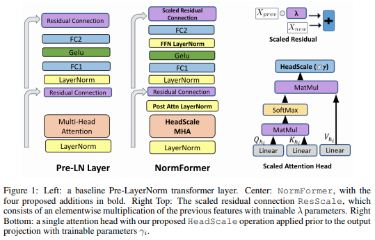

This <a href="https://openreview.net/forum?id=GMYWzWztDx5">paper</a> uncovers an issue with pre-norm transformers where gradients are mismatched between the early and later layers. They propose 4 changes, of which I will be offering 3.

The first change is to offer per head scaling after aggregating the values in attention. My experiments show a slight improvement in convergence.

```python
import torch
from x_transformers import TransformerWrapper, Decoder

model = TransformerWrapper(
    num_tokens = 20000,
    max_seq_len = 1024,
    attn_layers = Decoder(
        dim = 512,
        depth = 6,
        heads = 8,
        attn_head_scale = True  # set this to True
    )
)

x = torch.randint(0, 20000, (1, 1024))
model(x)
```

The second change is an extra layernorm right after the activation in the feedforward. I have also verified a slight improvement, at the cost of extra compute.

```python
import torch
from x_transformers import TransformerWrapper, Decoder

model = TransformerWrapper(
    num_tokens = 20000,
    max_seq_len = 1024,
    attn_layers = Decoder(
        dim = 512,
        depth = 6,
        heads = 8,
        ff_post_act_ln = True # set this to True
    )
)

x = torch.randint(0, 20000, (1, 1024))
model(x)
```

For the residual scaling, you simply have to set `scale_residual = True`. I have noticed slight improvements, but occasional instability as well, so use with caution.

```python
import torch
from x_transformers import TransformerWrapper, Decoder

model = TransformerWrapper(
    num_tokens = 20000,
    max_seq_len = 1024,
    attn_layers = Decoder(
        dim = 512,
        depth = 6,
        heads = 8,
        scale_residual = True # set this to True
    )
)

x = torch.randint(0, 20000, (1, 1024))
model(x)
```

The last change is a layernorm right after the outwards projection in attention. This is actually identical to the sandwich norm proposed by the Coqview paper, so you can use this by simply setting `sandwich_norm = True`, although it would also add it to the feedforward layer.

### Grouped Query-Key L2 Normalization

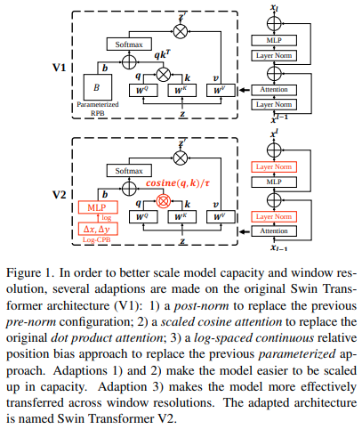</img>

This <a href="https://arxiv.org/abs/2010.04245">paper</a> proposes to l2 normalize the queries and keys along the head dimension before the dot product (cosine similarity), with the additional change of the scale being learned rather than static. The normalization prevents the attention operation from overflowing, and removes any need for numerical stability measures prior to softmax. Both are perennial problems when training transformers.

This was validated at scale recently by the training of <a href="https://arxiv.org/abs/2111.09883">a 3B parameter vision transformer</a>. The SwinV2 paper also proposes to change the pre-layernorm to a post-layernorm for further stability.

I have validated that this works just as well as dot product attention in an autoregressive setting, if one were to initialize the temperature as proposed in the QK-norm paper (as a function of the sequence length).

This flavor of attention also has <a href="https://arxiv.org/abs/2111.05498">a connection</a> to sparse distributed memory. <a href="https://www.youtube.com/watch?v=THIIk7LR9_8">[youtube talk]</a>

Update: I have discovered a way to remove the learned temperature altogether, by grouping the feature dimension and doing l2-normalization on each group. This allows the queries and keys to have a similarity that is upper bounded by the number of groups. A group size of 8 or 16 was sufficient in my tests. Decided to name this technique "Grouped QK Normalization". The drawback is that I believe an attention head dimension 32 is too small to use this tactic (a dimension often used in vision)

You can use it as follows

```python
import torch
from x_transformers import TransformerWrapper, Decoder

model = TransformerWrapper(
    num_tokens = 20000,
    max_seq_len = 1024,
    attn_layers = Decoder(
        dim = 512,
        depth = 6,
        heads = 8,
        attn_qk_norm = True,       # set this to True
        attn_qk_norm_groups = 8    # number of groups in the feature dimension for l2norm, similarity scores will be bounded between [-group, group]. determines how sharp the attention can be
    )
)

x = torch.randint(0, 20000, (1, 1024))
model(x)
```

Another update: Simply scaling the cosine similarity (group of 1) with a fixed constant (10) may work too

```python
import torch
from x_transformers import TransformerWrapper, Decoder

model = TransformerWrapper(
    num_tokens = 20000,
    max_seq_len = 1024,
    attn_layers = Decoder(
        dim = 512,
        depth = 6,
        heads = 8,
        attn_qk_norm = True,       # set to True
        attn_qk_norm_scale = 10    # new scale on the similarity, with groups of 1
    )
)

x = torch.randint(0, 20000, (1, 1024))
model(x)
```

### Turning off absolute positional embedding

A number of papers have hinted that causal transformers (`Decoder`) can learn absolute positions in the absence of added embeddings of any sort. This was recently thoroughly investigated <a href="https://arxiv.org/abs/2203.16634">here</a>. You can turn off the absolute positional embedding by setting `use_abs_pos_emb = False` in the `TransformerWrapper`

Given <a href="https://ai.googleblog.com/2022/04/pathways-language-model-palm-scaling-to.html">PaLM</a>, the trend going forward may be to forgo absolute positional embedding (again, for causal transformers only), and add relative positional embeddings with RoPE, ALiBi, etc.

```python
import torch
from x_transformers import TransformerWrapper, Decoder

model = TransformerWrapper(
    num_tokens = 20000,
    max_seq_len = 1024,
    use_abs_pos_emb = False,   # set this to False
    attn_layers = Decoder(
        dim = 512,
        depth = 6,
        heads = 8,
    )
)

x = torch.randint(0, 20000, (1, 1024))
model(x)
```

### Forgetful Causal Mask

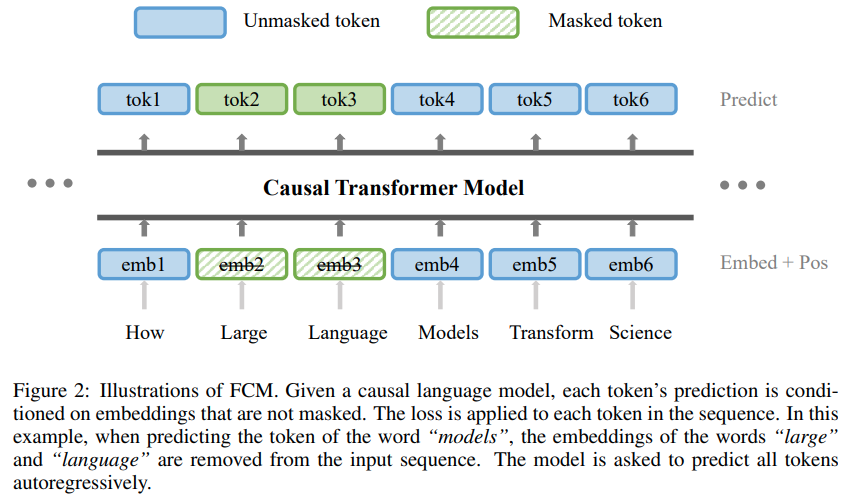</img>

<a href="https://arxiv.org/abs/2210.13432">This paper</a> shows convincing results that one can combine masking (from masked language modeling) with autoregressive training, leading to significantly better results.

You can use this by setting the `mask_prob` on the `AutoregressiveWrapper` class


```python
import torch
from x_transformers import TransformerWrapper, Decoder, AutoregressiveWrapper

model = TransformerWrapper(
    num_tokens = 20000,
    max_seq_len = 1024,
    attn_layers = Decoder(
        dim = 512,
        depth = 12,
        heads = 8
    )
)

model = AutoregressiveWrapper(
    model,
    mask_prob = 0.15  # in paper, they use 15%, same as BERT
).cuda()

# mock data

x = torch.randint(0, 20000, (1, 1024)).cuda()

# derive cross entropy loss, masking all taken care of

loss = model(x)
loss.backward()
```


## Miscellaneous

Cross Attention

```python
import torch
from x_transformers import Encoder, CrossAttender

enc = Encoder(dim = 512, depth = 6)
model = CrossAttender(dim = 512, depth = 6)

nodes = torch.randn(1, 1, 512)
node_masks = torch.ones(1, 1).bool()

neighbors = torch.randn(1, 5, 512)
neighbor_masks = torch.ones(1, 5).bool()

encoded_neighbors = enc(neighbors, mask = neighbor_masks)
model(nodes, context = encoded_neighbors, mask = node_masks, context_mask = neighbor_masks) # (1, 1, 512)

```

Pass in continuous values

```python
import torch
from x_transformers import ContinuousTransformerWrapper, Decoder

model = ContinuousTransformerWrapper(
    dim_in = 32,
    dim_out = 100,
    max_seq_len = 1024,
    attn_layers = Decoder(
        dim = 512,
        depth = 12,
        heads = 8
    )
)

x = torch.randn((1, 1024, 32))

model(x) # (1, 1024, 100)
```

You can also train a transformer that accepts continuous values autoregressively easily, in the same scheme as done successfully in <a href="https://arxiv.org/abs/2112.05329">this paper</a>

```python
import torch
from x_transformers import ContinuousTransformerWrapper, Decoder
from x_transformers import ContinuousAutoregressiveWrapper

model = ContinuousTransformerWrapper(
    dim_in = 777,
    dim_out = 777,
    max_seq_len = 1024,
    attn_layers = Decoder(
        dim = 512,
        depth = 12,
        heads = 8
    )
)

# wrap it with the continuous autoregressive wrapper

model = ContinuousAutoregressiveWrapper(model)

# mock data

x = torch.randn((1, 1024, 777))
mask = torch.ones(1, 1024).bool()

# train on a lot of data above

loss = model(x, mask = mask)
loss.backward

# then generate

start_emb = torch.randn(1, 777)
generated = model.generate(start_emb, 17) # (17, 777)
```

## Citations

```bibtex
@misc{vaswani2017attention,
    title   = {Attention Is All You Need},
    author  = {Ashish Vaswani and Noam Shazeer and Niki Parmar and Jakob Uszkoreit and Llion Jones and Aidan N. Gomez and Lukasz Kaiser and Illia Polosukhin},
    year    = {2017},
    eprint  = {1706.03762},
    archivePrefix = {arXiv},
    primaryClass = {cs.CL}
}
```

```bibtex
@article{DBLP:journals/corr/abs-1907-01470,
    author    = {Sainbayar Sukhbaatar and
               Edouard Grave and
               Guillaume Lample and
               Herv{\'{e}} J{\'{e}}gou and
               Armand Joulin},
    title     = {Augmenting Self-attention with Persistent Memory},
    journal   = {CoRR},
    volume    = {abs/1907.01470},
    year      = {2019},
    url       = {http://arxiv.org/abs/1907.01470}
}
```

```bibtex
@article{1910.05895,
    author  = {Toan Q. Nguyen and Julian Salazar},
    title   = {Transformers without Tears: Improving the Normalization of Self-Attention},
    year    = {2019},
    eprint  = {arXiv:1910.05895},
    doi     = {10.5281/zenodo.3525484},
}
```

```bibtex
@misc{shazeer2020glu,
    title   = {GLU Variants Improve Transformer},
    author  = {Noam Shazeer},
    year    = {2020},
    url     = {https://arxiv.org/abs/2002.05202}    
}
```

```bibtex
@misc{bhojanapalli2020lowrank,
    title   = {Low-Rank Bottleneck in Multi-head Attention Models},
    author  = {Srinadh Bhojanapalli and Chulhee Yun and Ankit Singh Rawat and Sashank J. Reddi and Sanjiv Kumar},
    year    = {2020},
    eprint  = {2002.07028}
}
```

```bibtex
@misc{burtsev2020memory,
    title   = {Memory Transformer}, 
    author  = {Mikhail S. Burtsev and Grigory V. Sapunov},
    year    = {2020},
    eprint  = {2006.11527},
    archivePrefix = {arXiv},
    primaryClass = {cs.CL}
}
```

```bibtex
@misc{zhao2019explicit,
    title   = {Explicit Sparse Transformer: Concentrated Attention Through Explicit Selection}, 
    author  = {Guangxiang Zhao and Junyang Lin and Zhiyuan Zhang and Xuancheng Ren and Qi Su and Xu Sun},
    year    = {2019},
    eprint  = {1912.11637},
    archivePrefix = {arXiv},
    primaryClass = {cs.CL}
}
```

```bibtex
@misc{correia2019adaptively,
    title   = {Adaptively Sparse Transformers},
    author  = {Gonçalo M. Correia and Vlad Niculae and André F. T. Martins},
    year    = {2019},
    eprint  = {1909.00015},
    archivePrefix = {arXiv},
    primaryClass = {cs.CL}
}
```

```bibtex
@misc{shazeer2020talkingheads,
    title   = {Talking-Heads Attention}, 
    author  = {Noam Shazeer and Zhenzhong Lan and Youlong Cheng and Nan Ding and Le Hou},
    year    = {2020},
    eprint  = {2003.02436},
    archivePrefix = {arXiv},
    primaryClass = {cs.LG}
}
```

```bibtex
@misc{press2020improving,
    title   = {Improving Transformer Models by Reordering their Sublayers}, 
    author  = {Ofir Press and Noah A. Smith and Omer Levy},
    year    = {2020},
    eprint  = {1911.03864},
    archivePrefix = {arXiv},
    primaryClass = {cs.CL}
}
```

```bibtex
@misc{lu2019understanding,
    title   = {Understanding and Improving Transformer From a Multi-Particle Dynamic System Point of View}, 
    author  = {Yiping Lu and Zhuohan Li and Di He and Zhiqing Sun and Bin Dong and Tao Qin and Liwei Wang and Tie-Yan Liu},
    year    = {2019},
    eprint  = {1906.02762},
    archivePrefix = {arXiv},
    primaryClass = {cs.LG}
}
```

```bibtex
@misc{ke2020rethinking,
    title     = {Rethinking Positional Encoding in Language Pre-training},
    author    = {Guolin Ke and Di He and Tie-Yan Liu},
    year      = {2020},
    eprint    = {2006.15595},
    archivePrefix = {arXiv},
    primaryClass = {cs.CL}
}
```

```bibtex
@misc{dosovitskiy2020image,
    title   = {An Image is Worth 16x16 Words: Transformers for Image Recognition at Scale},
    author  = {Alexey Dosovitskiy and Lucas Beyer and Alexander Kolesnikov and Dirk Weissenborn and Xiaohua Zhai and Thomas Unterthiner and Mostafa Dehghani and Matthias Minderer and Georg Heigold and Sylvain Gelly and Jakob Uszkoreit and Neil Houlsby},
    year    = {2020},
    eprint  = {2010.11929},
    archivePrefix = {arXiv},
    primaryClass = {cs.CV}
}
```

```bibtex
@misc{huang2019attention,
    title   = {Attention on Attention for Image Captioning},
    author  = {Lun Huang and Wenmin Wang and Jie Chen and Xiao-Yong Wei},
    year    = {2019},
    eprint  = {1908.06954},
    archivePrefix = {arXiv},
    primaryClass = {cs.CV}
}
```

```bibtex
@misc{raffel2020exploring,
    title   = {Exploring the Limits of Transfer Learning with a Unified Text-to-Text Transformer}, 
    author  = {Colin Raffel and Noam Shazeer and Adam Roberts and Katherine Lee and Sharan Narang and Michael Matena and Yanqi Zhou and Wei Li and Peter J. Liu},
    year    = {2020},
    eprint  = {1910.10683},
    archivePrefix = {arXiv},
    primaryClass = {cs.LG}
}
```

```bibtex
@inproceedings{martins-etal-2020-sparse,
    title   = "Sparse Text Generation",
    author  = "Martins, Pedro Henrique  and
        Marinho, Zita  and
        Martins, Andr{\'e} F. T.",
    booktitle = "Proceedings of the 2020 Conference on Empirical Methods in Natural Language Processing (EMNLP)",
    month   = nov,
    year    = "2020",
    address = "Online",
    publisher = "Association for Computational Linguistics",
    url     = "https://www.aclweb.org/anthology/2020.emnlp-main.348"
}
```

```bibtex
@misc{he2020realformer,
    title   = {RealFormer: Transformer Likes Residual Attention},
    author  = {Ruining He and Anirudh Ravula and Bhargav Kanagal and Joshua Ainslie},
    year    = {2020},
    eprint  = {2012.11747},
    archivePrefix = {arXiv},
    primaryClass = {cs.LG}
}
```

```bibtex
@misc{carion2020endtoend,
    title   = {End-to-End Object Detection with Transformers},
    author  = {Nicolas Carion and Francisco Massa and Gabriel Synnaeve and Nicolas Usunier and Alexander Kirillov and Sergey Zagoruyko},
    year    = {2020},
    eprint  = {2005.12872},
    archivePrefix = {arXiv},
    primaryClass = {cs.CV}
}
```

```bibtex
@misc{press2021ALiBi,
    title   = {Train Short, Test Long: Attention with Linear Biases Enable Input Length Extrapolation},
    author  = {Ofir Press and Noah A. Smith and Mike Lewis},
    year    = {2021},
    url     = {https://ofir.io/train_short_test_long.pdf}
}
```

```bibtex
@misc{parisotto2019stabilizing,
    title     = {Stabilizing Transformers for Reinforcement Learning},
    author    = {Emilio Parisotto and H. Francis Song and Jack W. Rae and Razvan Pascanu and Caglar Gulcehre and Siddhant M. Jayakumar and Max Jaderberg and Raphael Lopez Kaufman and Aidan Clark and Seb Noury and Matthew M. Botvinick and Nicolas Heess and Raia Hadsell},
    year      = {2019},
    eprint    = {1910.06764},
    archivePrefix = {arXiv},
    primaryClass = {cs.LG}
}
```

```bibtex
@misc{narang2021transformer,
    title       = {Do Transformer Modifications Transfer Across Implementations and Applications?},
    author      = {Sharan Narang and Hyung Won Chung and Yi Tay and William Fedus and Thibault Fevry and Michael Matena and Karishma Malkan and Noah Fiedel and Noam Shazeer and Zhenzhong Lan and Yanqi Zhou and Wei Li and Nan Ding and Jake Marcus and Adam Roberts and Colin Raffel},
    year        = {2021},
    eprint      = {2102.11972},
    archivePrefix = {arXiv},
    primaryClass = {cs.LG}
}
```

```bibtex
@misc{zhang2019root,
    title   = {Root Mean Square Layer Normalization},
    author  = {Biao Zhang and Rico Sennrich},
    year    = {2019},
    eprint  = {1910.07467},
    archivePrefix = {arXiv},
    primaryClass = {cs.LG}
}
```

```bibtex
@misc{su2021roformer,
    title   = {RoFormer: Enhanced Transformer with Rotary Position Embedding},
    author  = {Jianlin Su and Yu Lu and Shengfeng Pan and Bo Wen and Yunfeng Liu},
    year    = {2021},
    eprint  = {2104.09864},
    archivePrefix = {arXiv},
    primaryClass = {cs.CL}
}
```

```bibtex
@inproceedings{Sun2022ALT,
  title     = {A Length-Extrapolatable Transformer},
  author    = {Yutao Sun and Li Dong and Barun Patra and Shuming Ma and Shaohan Huang and Alon Benhaim and Vishrav Chaudhary and Xia Song and Furu Wei},
  year      = {2022}
}
```

```bibtex
@Article{AlphaFold2021,
    author  = {Jumper, John and Evans, Richard and Pritzel, Alexander and Green, Tim and Figurnov, Michael and Ronneberger, Olaf and Tunyasuvunakool, Kathryn and Bates, Russ and {\v{Z}}{\'\i}dek, Augustin and Potapenko, Anna and Bridgland, Alex and Meyer, Clemens and Kohl, Simon A A and Ballard, Andrew J and Cowie, Andrew and Romera-Paredes, Bernardino and Nikolov, Stanislav and Jain, Rishub and Adler, Jonas and Back, Trevor and Petersen, Stig and Reiman, David and Clancy, Ellen and Zielinski, Michal and Steinegger, Martin and Pacholska, Michalina and Berghammer, Tamas and Bodenstein, Sebastian and Silver, David and Vinyals, Oriol and Senior, Andrew W and Kavukcuoglu, Koray and Kohli, Pushmeet and Hassabis, Demis},
    journal = {Nature},
    title   = {Highly accurate protein structure prediction with {AlphaFold}},
    year    = {2021},
    doi     = {10.1038/s41586-021-03819-2},
    note    = {(Accelerated article preview)},
}
```

```bibtex
@software{peng_bo_2021_5196578,
    author       = {PENG Bo},
    title        = {BlinkDL/RWKV-LM: 0.01},
    month        = {aug},
    year         = {2021},
    publisher    = {Zenodo},
    version      = {0.01},
    doi          = {10.5281/zenodo.5196578},
    url          = {https://doi.org/10.5281/zenodo.5196578}
}
```

```bibtex
@misc{csordás2021devil,
    title   = {The Devil is in the Detail: Simple Tricks Improve Systematic Generalization of Transformers},
    author  = {Róbert Csordás and Kazuki Irie and Jürgen Schmidhuber},
    year    = {2021},
    eprint  = {2108.12284},
    archivePrefix = {arXiv},
    primaryClass = {cs.LG}
}
```

```bibtex
@misc{so2021primer,
    title   = {Primer: Searching for Efficient Transformers for Language Modeling}, 
    author  = {David R. So and Wojciech Mańke and Hanxiao Liu and Zihang Dai and Noam Shazeer and Quoc V. Le},
    year    = {2021},
    eprint  = {2109.08668},
    archivePrefix = {arXiv},
    primaryClass = {cs.LG}
}
```

```bibtex
@misc{ding2021erniedoc,
    title   = {ERNIE-Doc: A Retrospective Long-Document Modeling Transformer}, 
    author  = {Siyu Ding and Junyuan Shang and Shuohuan Wang and Yu Sun and Hao Tian and Hua Wu and Haifeng Wang},
    year    = {2021},
    eprint  = {2012.15688},
    archivePrefix = {arXiv},
    primaryClass = {cs.CL}
}
```

```bibtex
@misc{ding2021cogview,
    title   = {CogView: Mastering Text-to-Image Generation via Transformers},
    author  = {Ming Ding and Zhuoyi Yang and Wenyi Hong and Wendi Zheng and Chang Zhou and Da Yin and Junyang Lin and Xu Zou and Zhou Shao and Hongxia Yang and Jie Tang},
    year    = {2021},
    eprint  = {2105.13290},
    archivePrefix = {arXiv},
    primaryClass = {cs.CV}
}
```

```bibtex
@inproceedings{anonymous2022normformer,
    title   = {NormFormer: Improved Transformer Pretraining with Extra Normalization},
    author  = {Anonymous},
    booktitle = {Submitted to The Tenth International Conference on Learning Representations },
    year    = {2022},
    url     = {https://openreview.net/forum?id=GMYWzWztDx5},
    note    = {under review}
}
```

```bibtex
@misc{henry2020querykey,
    title   = {Query-Key Normalization for Transformers},
    author  = {Alex Henry and Prudhvi Raj Dachapally and Shubham Pawar and Yuxuan Chen},
    year    = {2020},
    eprint  = {2010.04245},
    archivePrefix = {arXiv},
    primaryClass = {cs.CL}
}
```

```bibtex
@misc{liu2021swin,
    title   = {Swin Transformer V2: Scaling Up Capacity and Resolution},
    author  = {Ze Liu and Han Hu and Yutong Lin and Zhuliang Yao and Zhenda Xie and Yixuan Wei and Jia Ning and Yue Cao and Zheng Zhang and Li Dong and Furu Wei and Baining Guo},
    year    = {2021},
    eprint  = {2111.09883},
    archivePrefix = {arXiv},
    primaryClass = {cs.CV}
}
```

```bibtex
@article{Haviv2022TransformerLM,
    title   = {Transformer Language Models without Positional Encodings Still Learn Positional Information},
    author  = {Adi Haviv and Ori Ram and Ofir Press and Peter Izsak and Omer Levy},
    journal = {ArXiv},
    year    = {2022},
    volume  = {abs/2203.16634}
}
```

```bibtex
@article{chowdhery2022PaLM,
    title   = {PaLM: Scaling Language Modeling with Pathways},
    author  = {Chowdhery, Aakanksha et al},
    year    = {2022}
}
```

```bibtex
@article{Shazeer2019FastTD,
    title   = {Fast Transformer Decoding: One Write-Head is All You Need},
    author  = {Noam M. Shazeer},
    journal = {ArXiv},
    year    = {2019},
    volume  = {abs/1911.02150}
}
```

```bibtex
@article{Wang2022DeepNetST,
    title   = {DeepNet: Scaling Transformers to 1, 000 Layers},
    author  = {Hongyu Wang and Shuming Ma and Li Dong and Shaohan Huang and Dongdong Zhang and Furu Wei},
    journal = {ArXiv},
    year    = {2022},
    volume  = {abs/2203.00555}
}
```

```bibtex
@misc{schlag2020enhancing,
    title   = {Enhancing the Transformer with explicit relational encoding for math problem solving},
    author  = {Imanol Schlag and Paul Smolensky and Roland Fernandez and Nebojsa Jojic and J{\"u}rgen Schmidhuber and Jianfeng Gao},
    year    = {2020},
    url     = {https://openreview.net/forum?id=B1xfElrKPr}
}
```

```bibtex
@article{Liu2022FCMFC,
    title   = {FCM: Forgetful Causal Masking Makes Causal Language Models Better Zero-Shot Learners},
    author  = {Hao Liu and Xinyang Geng and Lisa Lee and Igor Mordatch and Sergey Levine and Sharan Narang and P. Abbeel},
    journal = {ArXiv},
    year    = {2022},
    volume  = {abs/2210.13432}
}
```

```bibtex
@inproceedings{Huang2016DeepNW,
    title   = {Deep Networks with Stochastic Depth},
    author  = {Gao Huang and Yu Sun and Zhuang Liu and Daniel Sedra and Kilian Q. Weinberger},
    booktitle = {European Conference on Computer Vision},
    year    = {2016}
}
```

*solve intelligence... then use that to solve everything else.* - Demis Hassabis
